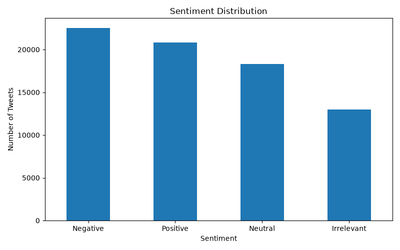
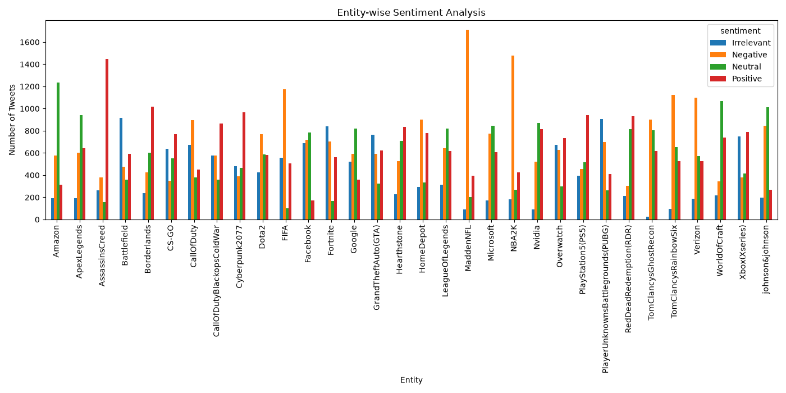

@"
# PRODIGY_DS_TASK_04

## Sentiment Analysis

This project performs sentiment analysis on social media data using Python. The objective is to analyze sentiment patterns and visualize the distribution of different sentiment categories across various entities.

## Technologies Used

- Python
- Pandas
- Matplotlib
- Git & GitHub

## Dataset

The project uses the `twitter_training.csv` dataset.

The dataset contains the following columns:

- `id` – Unique identifier
- `entity` – Entity or topic associated with the tweet
- `sentiment` – Sentiment classification
- `text` – Tweet text

### Dataset Information

- Total Records: 74,682
- Total Columns: 4

### Sentiment Categories

- Positive
- Negative
- Neutral
- Irrelevant

## Analysis Performed

### 1. Sentiment Distribution

The project analyzes the overall distribution of Positive, Negative, Neutral, and Irrelevant sentiments in the dataset.



### 2. Entity-wise Sentiment Analysis

The project analyzes sentiment across different entities to identify sentiment patterns associated with different topics.



## Project Structure

```text
PRODIGY_DS_TASK_04/
│
├── dataset/
│   └── twitter_training.csv
│
├── output/
│   ├── sentiment_distribution.png
│   └── entity_sentiment.png
│
├── src/
│   └── sentiment_analysis.py
│
├── .gitignore
└── README.md